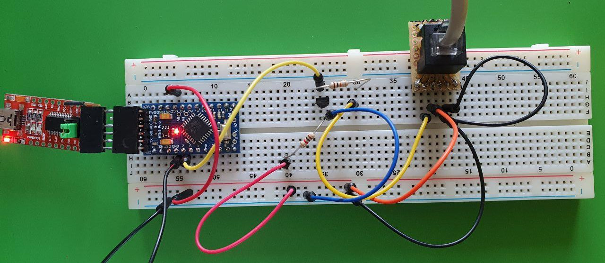

# arduino-tx20
this as an arduino script that can read and parse the datastream coming from a tx20 wind sensor. It tested on Arduino Pro Mini, Nano and esp8266, esp32.

## wiring

Here you need to be careful, since I found different color coding for the same sensor in the internet. However the pin order in the plug should be the same for all devices.

| pin | color | function |
|:--|:--|:--|
|1|black|serial|
|2|pink (red)|V+ 3.3-5V|
|3|green|DTR|
|4|yellow|GND (yes, yellow -.-)|


### for esp8266 or esp32
just wire up directly the cables to the esp as described in the table above.
Make sure to set ```INVERSE_LOGIC = false``` in the tx20.ini header.

### for other arduinos
Since the signal voltage is extremely low (~2V) we need an amplifier.
Here is the raw signal coming from the tx20 with 5V input (same for 3.3).


This can be done with a transistor, I had BC639 so I used them, but any one alike should work.
Make sure to set ```INVERSE_LOGIC = true``` in the tx20.ini header.




## run the code

configure the script with the settings in the tx20.ino files head as described in the comments there.
After flashing you should see the following on the serial monitor:
```
starting, direction in ddeg, speed in dm/s
ok,1575,0
ok,1575,65
ok,2025,36
ok,1125,63
ok,1125,37
ok,1125,26
ok,1125,55
ok,1350,42
ok,1575,30
```
The first value is the wind direction in decidegree, the second the wind speed in decimeter per second.

## troubleshooting

* if you see any fail messages enable the VERBOSE mode in the tx20.ino header
* if you are getting timeouts, check your wiring, and if the tx20 is getting 3.3 - 5V
* if you are getting a parse error and a lot of 11111... data, try changing INVERSE_LOGIC

## notes

[Thanks to John who decoded the tx20 protocol.](https://www.john.geek.nz/2011/07/la-crosse-tx20-anemometer-communication-protocol/)
